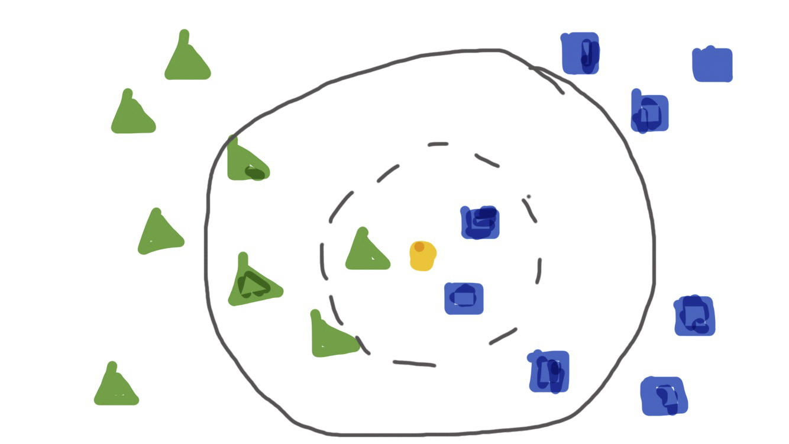
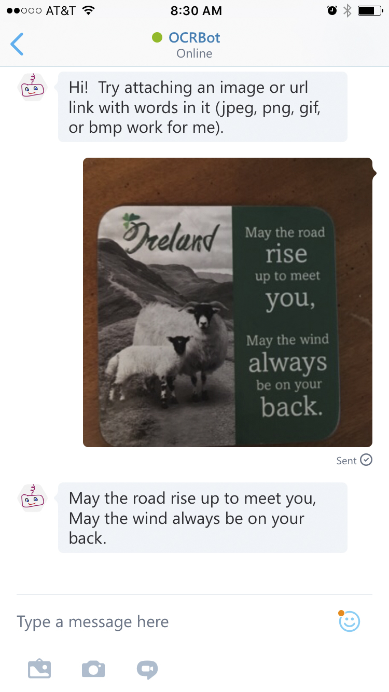

[**tl;dr**](https://en.wikipedia.org/wiki/TL;DR):  Chatterbots are trending bigtime!  Here, we continue the story of OCRBot, by introducing its new ability to get image text from attachments to the chat in addition to the image links we could already send.  For example, we can now take a picture with our phone and give it to OCRBot to extract out the text.  How cool is that??  Defintely could be the precursor to some more great abilities for this bot.

For the first two stories, see [Part 1](c) and [Part 2](https://michhar.github.io/posts/ocrbot-makes-a-connection).

### What's the wow factor?

Have you ever just wanted the text extracted from, perhaps a page in a book or a funny comic that's sitting around in an image?  Or maybe it'd be helpful to take a snapshot of a menu item wherein the font is a bit too small or you forgot your reading glasses, however, it's easy to read on your phone as plain text. Now, if you send the OCRBot an image (jpeg, png, gif, bmp are its known formats), on one of its supported conversational platforms like Skype or Slack, you'll get that text you crave.

<b>OCRBot on Skype - using a photo I just took of my favorite coaster sitting on my coffee table currently</b>

This is not only fun and useful it could be the precursor to adding text to speech, or TTS, to the bot itself as we've got a Cognitive Servies API for that (Bing Speech).  You can, of course at this point even, pipe this text into one of your TTS apps already on your device.

### (Re)Introducing OCR and the ML behind it all

OCR, or optical character recognition, is the electronic or mechnanical recognition of text in images and the conversion into machine-encoded representaions.  The text could be handwritten, typed or printed.  The data is an image such as scanned passports or financial data, business cards, postal mail, or any document as an image that someone wishes to digitize.

OCR is performed through **[pattern recognition](https://en.wikipedia.org/wiki/Pattern_recognition)** with components often pulled from AI and computer vision.  The process usually takes the form of:  pre-processing (fixing skew, noise reduction, conversion to black-and-white, and the like) - see figure below; character recognition through feature extraction and, often, a k-nearest neighbors classification (see figure below); post-processing such as validation through seeing co-occurrences of words (words that usually go together like "ice cream" instead of "ice pizza").  See the [Wikipedia article on OCR](https://en.wikipedia.org/wiki/Optical_character_recognition) for more.

Pre-processing example:

<b>An example of image pre-processing for character recognition:  fixing skew, binarisation, despekling, and line removal</b>

k-nearest neighbor example:

<b>Classifying the orange circle as a blue square or green triangle.  Note, that if k is 3, the circle is classified as a blue square, but with a k of 7 it is classified as a green triangle.  The structure of the data can cause for a tricky problem in k-NN</b>

Sometimes, OCR involves the human mind as the intelligence.  An example is the use of reCAPTCHA as a crowdsourcing effort for a two-fold purpose:  verification that the entity logging in somewhere is not a bot and crowdsourcing the recognition of hard to read text for the archiving of say 13 million articles from the NY Times starting with articles from 1851.

Nowadays, especially on devices like smart phones, the OCR model used to do this conversion to text is done in the cloud through an API.  This is how the Computer Vision API under the Cognitive Services umbrealla on Azure gets its results.

And for those who like a little history, note that OCR was known to be used in devices as early as 1914 with Emanuel Goldberg's invention of a machine that could read characters and convert them into standard [telegraph code](https://en.wikipedia.org/wiki/Telegraph_code) like Morse code (see [this Wikipedia](https://en.wikipedia.org/wiki/Optical_character_recognition) article for more history).  Skip ahead to today and we have optical word recognition (commonly called OCR) used for typewritten text and others like intelligent character recognition (ICR) for handwritten or cursive text.

### In code 

<b>Python 2 and JavaScript with D3 sharing variables (entire code sample is in the D3 Demo notebook that comes with Beaker)</b>

#### From the original OCRBot

OCRBot began with the ability to take a web link of an image with text and give us back the actual text in [Post 1](https://michhar.github.io/posts/how-to-bot-on-mac).  Now we've updated OCRBot quite a bit to also accept images as attachments to the conversation.

Below are the updates.

#### A Promise...

What is a Promise?

### The end of this chapter and OCRBot's next adventure

**
Python 2 and JavaScript with D3 sharing variables (entire code sample is in the D3 Demo notebook that comes with Beaker)
**

### Resources

