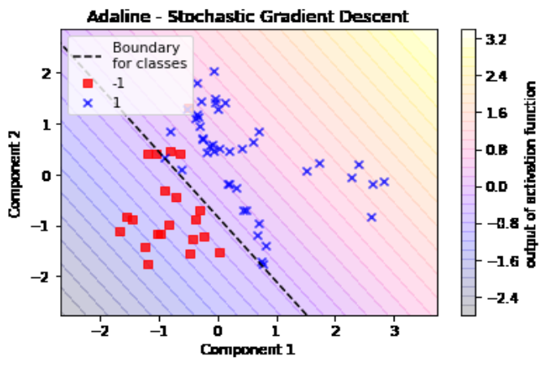

**tl:dr**:  Getting a simple, predictive framework distinguishing two types of leukemia based on biological markers from a single-layer neural network was not the intent of this exercise. It is, however, indicative of the power of a single artificial neuron and thoughtful feature reduction.


### Introduction

The intent of this post originally was to show the inner workings and limitations of a single artificial neuron using some moderately complex, noisy data; a challenge of sorts - "is this noisy data linearly separable with a single artificial neuron and if not, why is that?".  

However, I found with some data and algorithm exploration, that I could distinguish between two types of leukemia - a naive approach and not really biologically significant, but an interesting outcome nonetheless.  So, even though this post is about the data science, it also touches on a potential method to use in the real world.

In this post, you'll find information on the use of PCA for data reduction/feature engineering, scaling and normalization for preprocessin, the Adaline algorithm (artificial neuron), different activation functions, among other things.

[What is an Adaline artificial neuron](#what-is-an-adaline-artificial-neuron)


### What is an Adaline artificial neuron

1. Define adaline - like perceptron, but instead of step function, has linear activation
3. Stochastic gradient decent addition - point to original code
4. Activation function choices, we'll go into more detail later - Idea is that I will try out a different activation function (the decision boundary must still be linear, but the output will have a different distribution. 

The ADAptive LInear NEuron (Adaline) algorithm is very similar to a Perceptron (simplest of the artificial neurons) except that in the Perceptron, the weights are updated based on a unit step activation function (see figure below) and Adaline uses a linear activation function to update it's weights giving it a more robust result and prediction based on more information.  In Adaline a _quantizer_ after the activation function, is used to then predict class labels.

Beyond the linear activation function and the _quantizer_, we see the use of a _cost_ function, or an _objective function_, to update, or learn, the weights.  In this case we want to minimize it with an optimization method.  The optimization happens with yet another function aptly named an _optimization function_.  In this case our optimization function is _stochastic gradient decent_, which one can of as "climbing down a hill" to get to the minima of the cost function convex curve (as it updates weights iteratively from a shuffled dataset - if we calculated on the entire dataset each epoch it would be called _batch_ gradient decent as an aside).

I grabbed Sebastian Raschka's ADAptive LInear NEuron (Adaline) classifier OSS [here](https://github.com/PacktPublishing/Python-Machine-Learning/blob/master/3547_02_Code.ipynb) (the AdalineSGD) and updated the activation function to logistic sigmoid from a linear function.

So, in summary with the Adaline (versus the Perceptron) we use a continuous number rather than the binary class label, to compute the model error and update the weights.  Then to predict a class label, another function is used called a _quantizer_.  Also, the weights are updated in a more sophisticated manner.


### Choosing an activation function


In code, given this "net input" function:

```python
    def net_input(self, X):
        """Calculate net input"""
        return np.dot(X, self.w_[1:]) + self.w_[0]
```

I update the activatino function from linear as in:   

```python
    def activation(self, X):
        """Compute linear activation"""
        return self.net_input(X)
```

To a logistic sigmoidal function:

```python
    def activation(self, X):
        """Compute sigmoidal activation
        
        Returns
        -------
        A 1d array of length n_samples

        """
        x = self.net_input(X)
        func = lambda v: 1 / (1 + math.exp(-v))
        return np.array(list(map(func, x)))

```

**Linear classification boundaries**

These networks can only result in linear boundaries because...

### The noisy data

From [mldata.org](https://mldata.org).  Small, but wide ALL vs. AML leukemia dataset.  About 7000 biological markers, vs. x number of samples.

I tried just one feature reduction with PCA to reduce all 7000 dimensions to 2D at first.  However, I could not separate out the ALL samples from AML - this wasn't necessarily immportant to my post on Adaline neurons I was writing, but I decided to try something I'd read about recently for kicks.  In fact the idea sprung from a comment in a Python script where a perceptron was used to create non-linear separation of data for a plot (from [this](https://github.com/daniel-e/pymltools/blob/master/plot_scripts/plot_perceptron_nonlin.py) script on github).  The comment went:

```
# map the data into a space with one addition dimension so that
# it becomes linearly separable
```

So, I gave it a shot.

### 3D to run through network / 2D to gain insights

Then tried running through the neural network in 3D space (3 features or components from first PCA reduction).

I was surprised and impressed that I got a linearly separable result!  Albeit, that was not the intent of this exercise, but indicative of the power of a single neuron and thoughtful feature reduction.  It makes me wonder what a small neural network could do!



### Credits and further reading