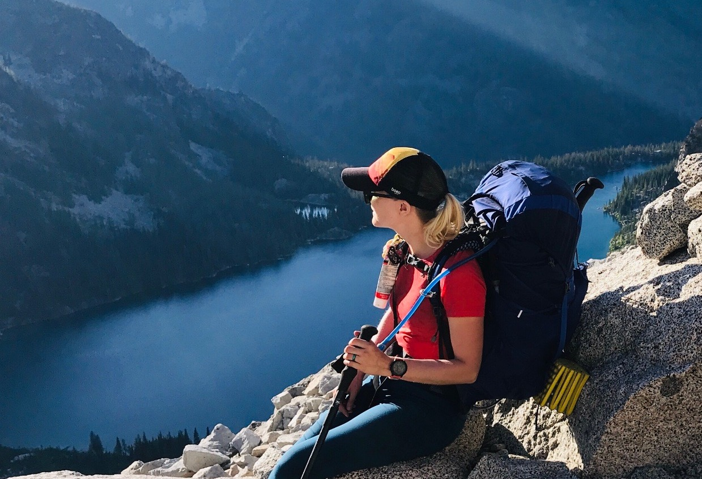

# Notes and Guides by Micheleen
### Topics You'll Find Here: Machine Learning, Python, Azure, Open-Source

Hi.  My name is Micheleen Harris ([LinkedIn](https://www.linkedin.com/in/micheleenharris/)) and I love the art of exploring and understanding data with scientific tools, languages and machine learning to create useful explanations of the world around us, a.k.a. models.

A little bit about me...

I studied biochemistry and computer science at the Univ. of Texas in Austin.  I'm currently a grad student in a Master's of bioinformatics program at NYU.  I continuously read research papers on subjects I care about, like visual anomaly detection and intertwining audio and visual signals to understand a scene better or just general ML on the edge/small devices - algorithms and optimizations (love [Papers with Code](https://paperswithcode.com/)).

I love the outdoors and live in the beautiful Pacific Northwest.

